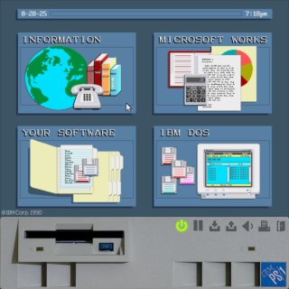
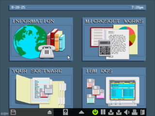
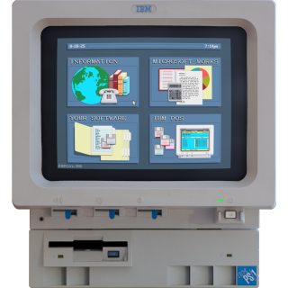
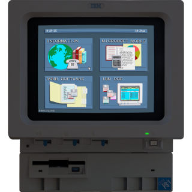
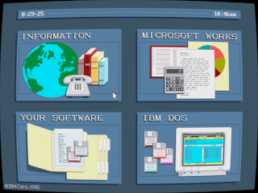
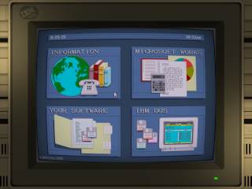

# USAGE

 - [Installation](#installation)
 - [Accessibility](#accessibility)
   - [Text-To-Speach (TTS)](#text-to-speach-tts)
     - [Text-To-Speech under DOS](#text-to-speech-under-dos)
       - [Connection to external synthesizer emulators](#connection-to-external-synthesizer-emulators)
       - [Notes for ASAP](#notes-for-asap)
   - [File select dialog window](#file-select-dialog-window)
   - [VGA color mode](#vga-color-mode)
   - [Key bindings](#key-bindings)
   - [GUI scaling](#gui-scaling)
   - [GUI theme](#gui-theme)
 - [CMOS and system configuration](#cmos-and-system-configuration)
 - [ROM set](#rom-set)
 - [HDD images](#hdd-images)
 - [Floppy disk images](#floppy-disk-images)
   - [High-level raw sector data emulation](#high-level-raw-sector-data-emulation)
   - [Low-level magnetic flux emulation](#low-level-magnetic-flux-emulation)
 - [CD-ROM drive](#cd-rom-drive)
 - [The GUI](#the-gui)
   - [Modes of operation](#modes-of-operation)
   - [Shaders](#shaders)
     - [Included shaders](#included-shaders)
     - [RetroArch shaders](#retroarch-shaders)
   - [Integer scaling](#integer-scaling)
 - [Savestates](#savestates)
 - [Audio](#audio)
   - [Sound Cards](#sound-cards)
   - [Reverb, Chorus, Crossfeed](#reverb-chorus-crossfeed)
   - [DSP filters](#dsp-filters)
 - [Joystick](#joystick)
 - [Emulation speed adjustments](#emulation-speed-adjustments)
 - [Serial ports](#serial-ports)
   - [Modem connections](#modem-connections)
     - [PRODIGY service](#prodigy-service)
     - [Modem troubleshooting](#modem-troubleshooting)
   - [Null modem connections](#null-modem-connections)
   - [Network options and limitations](#network-options-and-limitations)
   - [Named pipe and virtual COM port connections](#named-pipe-and-virtual-com-port-connections)
 - [Parallel port](#parallel-port)
   - [Virtual printer](#virtual-printer)
 - [MIDI output](#midi-output)
   - [MIDI on Windows](#midi-on-windows)
   - [MIDI on Linux](#midi-on-linux)
   - [SysEx delays and the Roland MT-32 "Exc. Buffer overflow" error](#sysex-delays-and-the-roland-mt-32-exc-buffer-overflow-error)
 - [Keymaps](#keymaps)
   - [Default key bindings](#default-key-bindings)
     - [Interface](#interface)
     - [Machine](#machine)
     - [Audio](#audio-1)
     - [Accessibility related](#accessibility-related)
 - [UI related key bindings](#ui-related-key-bindings)
 - [Command line options](#command-line-options)


## Installation

First of all obtain the original ROM.  
You have the following options:

 1. scour the Internet (there are various ROM sets available).
 2. if you have a real PS/1:
    * take the program `ROMDUMP.EXE` in the 'extra' folder and put it in an empty floppy disk; insert the floppy disk in your PS/1 and launch the executable: it will create the ROM image on the floppy disk.
    * you can also open your PS/1, extract the EPROMs and read them with an EPROM reader (you also need to merge the 2 halves in 1 file, or 4 in 2 if you have a non-US model).

Launch IBMulator. A window will inform you that the file **ibmulator.ini** has been created and where it is placed.

Put the ROM set anywhere you like (inside the same directory of ibmulator.ini is a good place) and update the `[system]:romset` setting in ibmulator.ini with the file name of the ROM set.

From now on IBMulator is ready to run.

You're not required to do anything else but IBMulator is very configurable. For more information regarding the various configuration options, other than this document you can also read the comments inside ibmulator.ini.

**Note for the Windows version**: if you have an HiDPI monitor, in order to avoid image blurring enable the HiDPI scaling override in the `ibmulator.exe` options and use IBMulator's GUI scaling option instead.


## Accessibility

### Text-To-Speach (TTS)

IBMulator has a TTS system that can be enabled to assist you in using its custom user interface and to act as an external syntetizer for DOS programs.

By default the TTS is disabled for both the GUI and the guest OS. To enable it either set `[tts]:gui_enabled` and `[tts]:guest_enabled` in ibmulator.ini, or at run-time use the following default key bindings:

 * <kbd>CTRL</kbd>+<kbd>SHIFT</kbd>+<kbd>3</kbd> : toggle TTS for the GUI
 * <kbd>CTRL</kbd>+<kbd>SHIFT</kbd>+<kbd>4</kbd> : toggle TTS for the guest OS 

Key bindings can be customized: see [Keymaps](#keymaps) for more info.

You can specify the device to use with `[tts]:dev` with the following values:

 * `synth` to use the default voice synthesizer for your system (SAPI on Windows, eSpeak on Linux).
 * `sapi` to use the SAPI interface (Windows only).
 * `nvda` to use the NVDA Controller Client API (Windows only).
 * `espeak` to use the eSpeak library (Linux only).
 * `file` to redirect voice text to a regular file.

If the TTS device is configured with `nvda`, the NVDA program must be running before launching IBMulator. If NVDA cannot be found SAPI will be used instead.  
The minimum NVDA supported version is 2024.1

For SAPI and eSpeak be sure to have voices installed and configured for your system.  
You can specify the voice to use with the `[tts]:voice` parameter. With SAPI you can use either a voice name string or a voice number; with eSpeak only a voice name is accepted.  
To use the default system voice specify the value `default` or leave it empty.  
To get the list of available voices leave the setting empty and search IBMulator's log file for TTS, SAPI, or eSpeak related messages.

If you want to use a `file`, you must specify its name with the `[tts]:file` setting. You can also specify the markup format to use with the `[tts]:file_format` setting, in case you intend to redirect the speech data to an external synthesizer.

For the list of key bindings used to control the TTS system see the [Text-To-Speech system](#text-to-speech-system) section down below.

#### Text-To-Speech under DOS

In order to get speech for DOS programs a TTS system must be installed in the guest DOS operating system. Some TTS systems are JAWS, Vocal-Eyes, and Automatic Screen Access Program (ASAP).

DOS speech systems rely on external synthesizer devices usually connected on the serial port.

IBMulator can emulate a Braille 'n Speak synthesizer (without indexing) connected to the serial port (COM). To enable the Braille 'n Speak emulation set the `[serial]:mode_a` (port A) or `[serial]:mode_b` (port B) settings to the value `speak`. Under DOS, port A is normally COM1 and port B is COM2.

IBMulator can also be configured to speak ASCII text printed to the parallel port (LPT). To enable TTS from the parallel port set the `[lpt]:speak` setting to `yes`.

The DOS environment uses code pages to format text. This text must be converted to unicode by IBMulator before it is spoken. The `[tts]:codepage` setting allows you to specify the DOS code page in use. The default is 437, which is the original one used for the IBM PC. The other common code page used internationally is 850.

##### Connection to external synthesizer emulators

If you want to use an external emulator to synthesize the TTS coming from DOS instead of the included Braille 'n Speak emulator, you can configure the serial port with the `pipe-client` mode.

See the [Named pipe and virtual COM port connections](#named-pipe-and-virtual-com-port-connections) section for more information.

##### Notes for ASAP

If you use a ROM set with the internal ROM drive, the `ASAPINST.EXE` program will complain about the impossibility of writing to the `D:` drive and the installation will fail.  
To solve this problem either set the `COMSPEC` environment variable to `C:\` first or use a ROM set without the ROM drive.

The "Other" synthesizer device option lets you select the LPT port. Use it if you want to keep the COM port free to be used for something else like for example a modem connection.

### File select dialog window

IBMulator implements a custom file selector dialog that integrates in its GUI's look & feel, works in full screen mode, and has additional features like the floppy image creator.

Alternatively you can use the standard file selector of your operating system. To do so set the `[gui_dialogs]:file_type` setting in ibmulator.ini to `native`.

### VGA color mode

The VGA image can be displayed using different color modes to try to solve issues related to color blindness.

You can set the color mode at start-up setting the `[display]:color_mode` to one of the following values:

 * `rgb`: Red - Green - Blue channel order (the default)
 * `gbr`: Green - Blue - Red channel order
 * `brg`: Blue - Red - Green channel order
 * `bgr`: Blue - Green - Red channel order
 * `inverted`: color inversion
 * `mono`: high contrast black-and-white monochromatic
 * `mono inverted`: inverted monochromatic

At run-time you can use the following default key bindings:

 * <kbd>CTRL</kbd>+<kbd>SHIFT</kbd>+<kbd>8</kbd> : cycle to previous VGA color mode
 * <kbd>CTRL</kbd>+<kbd>SHIFT</kbd>+<kbd>9</kbd> : cycle to next VGA color mode
 
### Key bindings

All of IBMulator's functions and UI elements can be operated with the keyboard.

For the full list of key bindings see the [Keymaps](#keymaps) and [UI related key bindings](#ui-related-key-bindings) sections down below.

### GUI scaling

The GUI can be scaled up to 500% either using the `[gui]:ui_scaling` option in ibmulator.ini or, at run-time, with the same method used by web browsers:

* <kbd>CTRL</kbd> + Mouse wheel up/down

### GUI theme

The custom dialog windows have a default dark theme inspired by the IBM ROMSHELL look and feel. A light theme with black text is also available: to use it set the value of `[gui_dialogs]:theme` to `light`.


## CMOS and system configuration

Being a faithful emulator of the PS/1 computer, after a configuration change (for example if you add more RAM) you need to update the PS/1's CMOS data, otherwise you'll get various POST errors (162, 164) at boot.

Modern PCs have a built-in BIOS menu but unfortunately the PS/1 relies on a two DOS programs:

* `CONFIGUR.EXE`: the system configuration updater.
* `CUSTOMIZ.EXE`: used to customize the way the system works.

You can usually find these programs inside the DOS directory after you restore the IBM's original preloaded software from a backup disk-set.  
Both files are copyrighted so you won't find them bundled with IBMulator.


## ROM set

Unless you download a ready-to-go PS/1 ROM set, you have to prepare ROM files in a specific way.

A ROM set can be either:

 1. A compressed archive in the ZIP format.
 2. A file with the *.BIN extension, named as you like.
 3. A directory.

Inside a ZIP file or directory there must be (file names are case insensitive):

 * `FC0000.BIN`: the system BIOS ROM, 128KiB or 256KiB, depending on the model.
 * `F80000.BIN`: the regional ROM, 256KiB, optional, only for non-US versions. For international models, this BIN file can be merged with `FC0000.BIN` to form a single 512KiB BIN file. In this case `FC0000.BIN`, if present, is ignored.

Any other file present in the archive or directory is ignored.

### Supported ROMs and models

IBMulator is a machine emulator and will use whatever BIOS code you make it load into memory. However it also detects and supports all known original PS/1 BIOSes.

Please note that the **P/N** and **MD5** values in the following list **refer only to the 64K BIOS code part of the ROM**, loaded at offset 0xFF0000. The additional parts with the BASIC interpreter, the video BIOS, and the ROM drive is not taken into consideration. IBMulator only uses the reported MD5 value to select the actual hardware configuration to use for any `auto` value present in the ibmulator.ini file.

IBM used the same ROM BIOS code for multiple models. The system configurations reported here and selected by IBMulator are just for your convenience. You can change every aspect of them.

| PS/1 | Region    | ROM drive | P/N     | MD5                                     | Model         | CPU             | RAM           | FDD         | HDD
| -----| ----------| --------- | ------- | --------------------------------------- | ------------- | --------------- | ------------- | ----------- | --------------------
| 2011 | US        | Yes       | 1057756 | f605 396b 48f0 2c5e 81bc 9e5e 5fb6 0717 | PS/1 2011-C34 | 80286 @ 10MHz   | 512KB + 512KB | 3.5" 1.44MB | 30MB XTA (type 35)
| 2011 | US, Intl. | Yes       | 1057760 | 9cac 91f1 fa7f e58d 9509 b754 785f 7fd2 | PS/1 2011-C34 | 80286 @ 10MHz   | 512KB + 512KB | 3.5" 1.44MB | 30MB XTA (type 35)
| 2011 | Canada    | Yes       | 1057665 | f355 b8ed 749c f80e 05c8 30b1 ab95 9f61 | PS/1 2011-C34 | 80286 @ 10MHz   | 512KB + 512KB | 3.5" 1.44MB | 30MB XTA (type 35)
| 2121 | US        | Yes       | 92F9674 | 1594 13f1 90f0 75b9 2ffb 8823 31c7 0eaf | PS/1 2121-B82 | 80386SX @ 16MHz | 2048KB        | 3.5" 1.44MB | 80MB ATA
| 2121 | Intl.     | Yes       | 92F9606 | 7b5f 6e38 03ee 57fd 9504 7738 d36f 12fd | PS/1 2121-B82 | 80386SX @ 16MHz | 2048KB        | 3.5" 1.44MB | 80MB ATA
| 2121 | All       | No        | 93F2455 | 01ae 622a b197 b057 c92a d783 2f86 8b4c | PS/1 2121-A82 | 80386SX @ 20MHz | 2048KB        | 3.5" 1.44MB | 80MB ATA


## HDD images

The first time you launch IBMulator an empty pre-formatted hard disk image will be created. Type and size will be selected according to the loaded ROM.

If you have an original PS/1 backup disk-set you can restore the machine to its factory state.  
In order to do so:

 1. Insert a PC-DOS 4.0 floppy disk in drive A.
 2. Go to the DOS command prompt.
 3. Run `a:restore a: c: /s`

Under Linux you can mount the HDD image using this command:

```
$ udisksctl loop-setup -f hdd.img
```

In order to mount partitioned loop devices, it might be necessary to add this kernel parameter to your GRUB configuration:

```
loop.max_part=31
```

Alternatively you can use the mount command:

```
$ sudo mount -o loop,offset=16896 hdd.img /mnt/loop
```

The offset value is equal to "start sector"*512. The start sector value can be determined with:

```
$ fdisk -l hdd.img
```

### HDD types

These are the HDD types supported by the PS/1 BIOS.

This table was defined by IBM and is common to many (possibly all) of the their products of the '80s and early '90s.

While rendered irrelevant with the introduction of the ATA interface in the PS/1 model 2121, the HDD table is still present in the BIOS and can be used by IBMulator to quickly specify a geometry and create a pre-formatted hard disk image.

To create a pre-formatted image set the type of the desired disk in the `[hdd]:type` setting.

If you use the user defined type 47, the automatically created image will be 0-filled instead, and you'll need to use `FDISK` and `FORMAT` in order to use it.

*Note*: "type 47" is an IBMulator only feature. In the original BIOS the last 3 table entries are blank and the PS/1 has no means to define a custom geometry.

*Note*: the biggest formattable HDD you can define using the PS/1 model 2011 is 496MiB (CHS 1024/16/62), due to an original BIOS bug that limits the sectors per track to 62 instead of 63.

Type | Cyl. | Heads | Sect. | WPcom | Land Zone | Size
---- | ---- | ----- | ----- | ----- | --------- | ------
   0 |    0 |     0 |     0 |     0 |         0 | (none)
   1 |  306 |     4 |    17 |   128 |       305 |  10MB
   2 |  615 |     4 |    17 |   300 |       615 |  20MB
   3 |  615 |     6 |    17 |   300 |       615 |  31MB
   4 |  940 |     8 |    17 |   512 |       940 |  62MB
   5 |  940 |     6 |    17 |   512 |       940 |  47MB
   6 |  615 |     4 |    17 |    -1 |       615 |  20MB
   7 |  462 |     8 |    17 |   256 |       511 |  31MB
   8 |  733 |     5 |    17 |    -1 |       733 |  30MB
   9 |  900 |    15 |    17 |    -1 |       901 | 112MB
  10 |  820 |     3 |    17 |    -1 |       820 |  20MB
  11 |  855 |     5 |    17 |    -1 |       855 |  35MB
  12 |  855 |     7 |    17 |    -1 |       855 |  50MB
  13 |  306 |     8 |    17 |   128 |       319 |  20MB
  14 |  733 |     7 |    17 |    -1 |       733 |  43MB
  15 |    0 |     0 |     0 |     0 |         0 | (none)
  16 |  612 |     4 |    17 |     0 |       663 |  20MB
  17 |  977 |     5 |    17 |   300 |       977 |  41MB
  18 |  977 |     7 |    17 |    -1 |       977 |  57MB
  19 | 1024 |     7 |    17 |   512 |      1023 |  59MB
  20 |  733 |     5 |    17 |   300 |       732 |  30MB
  21 |  733 |     7 |    17 |   300 |       732 |  43MB
  22 |  733 |     5 |    17 |   300 |       733 |  30MB
  23 |  306 |     4 |    17 |     0 |       336 |  10MB
  24 |  612 |     4 |    17 |   305 |       663 |  20MB
  25 |  306 |     4 |    17 |    -1 |       340 |  10MB
  26 |  612 |     4 |    17 |    -1 |       670 |  20MB
  27 |  698 |     7 |    17 |   300 |       732 |  41MB
  28 |  976 |     5 |    17 |   488 |       977 |  40MB
  29 |  306 |     4 |    17 |     0 |       340 |  10MB
  30 |  611 |     4 |    17 |   306 |       663 |  20MB
  31 |  732 |     7 |    17 |   300 |       732 |  43MB
  32 | 1023 |     5 |    17 |    -1 |      1023 |  42MB
  33 |  614 |     4 |    25 |    -1 |       663 |  30MB
  34 |  775 |     2 |    27 |    -1 |       900 |  20MB
  35 |  921 |     2 |    33 |    -1 |      1000 |  30MB
  36 |  402 |     4 |    26 |    -1 |       460 |  20MB
  37 |  580 |     6 |    26 |    -1 |       640 |  44MB
  38 |  845 |     2 |    36 |    -1 |      1023 |  30MB
  39 |  769 |     3 |    36 |    -1 |      1023 |  41MB
  40 |  531 |     4 |    39 |    -1 |       532 |  40MB
  41 |  577 |     2 |    36 |    -1 |      1023 |  20MB
  42 |  654 |     2 |    32 |    -1 |       674 |  20MB
  43 |  923 |     5 |    36 |    -1 |      1023 |  81MB
  44 |  531 |     8 |    39 |    -1 |       532 |  81MB
  45 |    0 |     0 |     0 |     0 |         0 | (none)
  46 |    0 |     0 |     0 |     0 |         0 | (none)
  47 |      |       |       |       |           | _user defined type_


## Floppy disk images

IBMulator has two types of floppy drive emulation: a fast high-level emulation based on raw sector data and a more precise (but much slower) low-level one based on magnetic flux changes.

You can create new floppy disk images using the floppy disk image selector window. The type of the images available depend on the type of FDC emulation used. All new images are pre-formatted and ready to use.

The floppy image file selector will show only the image files compatible with the active drive (according to its size and supported media density) and emulation type.

### High-level raw sector data emulation

This is the fastest type and is enabled by default. With this type only stardard DOS-formatted images can be used (512 bytes per sector).

The supported imageformats are:

 * Raw sector image (*.img, *.ima) read/write
 * ImageDisk (*.imd) read-only (standard DOS-formatted disks only)

You usually want to use this type unless you need to use copy-protected floppy disks or want to experiment with low-level floppy emulation.

This type is enabled by setting the following option in ibmulator.ini:

```
[drives]
fdc_type = raw
```

### Low-level magnetic flux emulation

This is the more precise and computationally heavy type. With this type you can use non-standard floppy images having arbitrary layouts and sector sizes.

The supported image formats are:

 * Raw sector image (*.img, *.ima) read/write
 * HxC Floppy Emulator HFE v.1 (*.hfe) read/write
 * SPS IPF (*.ipf) read-only (limited support)
 * TeleDisk TD0 (*.td0) read-only
 * ImageDisk (*.imd) read-only
 * 86Box 86F (*.86f) read-only

You should use this type to make copy-protected floppy disks work. Except for raw sector *.img files, the other supported formats allow to emulate various types of copy protection schemes.

This type is enabled by setting the following option in ibmulator.ini:

```
[drives]
fdc_type=flux
```


## CD-ROM drive

IBMulator can emulate an ATAPI CD-ROM drive (PIO mode).

To install the drive, specify its speed using the following option in ibmulator.ini:

```
[drives]
cdrom = 2x
```

The value of the speed is a multiplicative factor relative to the original "1x" speed of 150KB/s (the value is capped to 72x for practical reasons).

If you want to insert a CD-ROM disc at program launch, you can specify the image path in the `[cdrom]` ini section. Otherwise you can insert a new CD-ROM disc using the graphical interface:

 1. make the CD-ROM drive active by clicking the drive selection button or with the <kbd>CTRL</kbd>+<kbd>SHIFT</kbd>+<kbd>F7</kbd> key combination.
 2. click on the drive or press <kbd>SHIFT</kbd>+<kbd>F7</kbd>

The following disc image formats are supported:

 * ISO 9660 optical disc image (*.iso)
 * CUE/BIN (*.cue)

Audio tracks in CUE/BIN images can be of the following formats:

 * Raw binary (*.bin) (16-bit signed, 2-channel, 44100 Hz)
 * FLAC (*.flac)
 * WAV (*.wav)
 * Vorbis (*.ogg)
 * MP3 (*.mp3)

*Note:* depending on how fast your system is, using audio formats other than raw binary may result in longer seek times, which may cause audio stuttering in some games.

In order to use the drive under DOS and Windows 3.x you also need:

 1. an ATAPI CD-ROM driver loaded in CONFIG.SYS (like XCDROM.SYS or VIDE-CDD.SYS)
 2. a CD-ROM extension application run in AUTOEXEC.BAT (such as MSCDEX.EXE)

Here's an example configuration that maps the CD-ROM drive to the letter `D:`

```
CONFIG.SYS
DEVICE=C:\CDROM\XCDROM.SYS /D:MSCD001

AUTOEXEC.BAT
C:\DOS\MSCDEX.EXE /D:MSCD001 /M:10 /L:D
```

In the `share/ibmulator/extra` directory of the IBMulator package you can find the `XCDROM-driver.img` floppy image file with the GPL licensed XCDROM driver you can use.  
Otherwise if you want a floppy image with the VIDE-CDD driver you can try this: https://archive.org/details/mscdex-2.23-installer-incl.-vide-cdd

*Note:* ATAPI drivers are not all the same and you can have different results depending on the running program. For example with XCDROM.SYS the stock Media Player included in Windows 3.x won't play mixed mode CDs, while it works properly with VIDE-CDD.SYS.


## The GUI

### Modes of operation

IBMulator has 3 different GUI modes.

You can select the starting GUI mode with the `[gui]:mode` setting of ibmulator.ini.

#### Normal mode

Normal is the default mode. The control panel (in the shape of the system unit) places itself at the bottom of the VGA display and it's always visible.

You can switch to Compact mode at run-time using the default key binding <kbd>SHIFT</kbd>+<kbd>F1</kbd>.

[](./images/normal-mode.png)

#### Compact mode

In compact mode the VGA image fills the available window space and the control panel, in the shape of a semi-transparent bar or the PS/1 system unit, auto-hides after a while, and disappears when input is grabbed. Use this mode if you want an experience similar to DOSBox's.

You can switch to Normal mode at run-time using the default key binding <kbd>SHIFT</kbd>+<kbd>F1</kbd>.

[](./images/compact-mode.png)

#### Realistic mode

Realistic is the hardcore mode, for the retro enthusiasts who want to truly experience the PS/1. In this mode the system is rendered in its entirety, monitor included. There are no additional buttons and controls except the originals: volume, brightness, contrast, power, and floppy (you need to use the key bindings for any extra function).

Two styles are available in this mode: "bright" (daytime) and "dark" (nighttime). You can also zoom in to the monitor to have a better view.

When in Realistic mode, in order to change to Normal or Compact you need to restart IBMulator with the desired mode set in ibmulator.ini.

The default key bindings for this mode are:

 * <kbd>CTRL</kbd>+<kbd>F1</kbd>: toggle zoomed view.
 * <kbd>SHIFT</kbd>+<kbd>F1</kbd>: switch between bright and dark styles.

[](./images/realistic-mode.png) [](./images/realistic-mode-dark.png)

### Shaders

IBMulator uses a shader system that implements the new (_draft_) libretro's [Vulkan GLSL RetroArch shader system](https://github.com/libretro/slang-shaders) specification, with only minor differences and some extension.

For more information about the IBMulator's shader system see [SHADERS.md](./SHADERS.md).

Shader files should be installed in either:

 * the `shaders` directory inside the user's directory (takes precedence).
 * the global assets directory `share/ibmulator/shaders`.

A shader is defined by a preset (`.slangp`) and at least one source file (`.slang`).  
To load a shader in IBMulator you need to specify the path of its `.slangp` preset file in ibmulator.ini. You cannot load `.slang` source files directly.

Shader paths must be relative, eg.:

```
[display]
; shader used in Normal and Compact modes
normal_shader = normal_mode/stock.slangp
; shader used in Realistic mode
realistic_shader = realistic_mode/stock.slangp
```

Some shaders have configurable parameters that can be modified while IBMulator is running. See the default key combination to open the configuration window in the [Default key bindings](#default-key-bindings) section.

New presets will be saved inside the user's `shaders` directory.

#### Included shaders

 * `normal_mode/stock.slangp`: stock shader for Normal and Compact modes with bilinear filtering.
 * `normal_mode/nearest_filter.slangp`: stock shader with nearest neighbour filtering (pixelated, useful with integer scaling).
 * `normal_mode/bicubic_filter.slangp`: stock shader with bicubic filtering.
 * `realistic_mode/stock.slangp`: stock shader for Realistic mode.
 * `ps1/monitor.slangp`: a realistic representation of the PS/1 monitor with light reflections (for any mode).
 * `crt/lottes.slangp`: the CRT shader by Timothy Lottes.

[](./images/shaders-crt-lottes.png)

#### RetroArch shaders

IBMulator's shader system aims to be fully compatible with the _Vulkan GLSL RetroArch shader system_ but keep in mind that:

 1. the libretro's specification is still a draft and evolving, so more recent versions of its shaders might fail to load in IBMulator.
 2. IBMulator is based on the public specification, so shaders that rely on specific RetroArch behaviours (or bugs) might not work as expected.

A Vulkan GLSL RetroArch shader source is translated to OpenGL GLSL by IBMulator and can be used unmodified, assuming your video card supports the OpenGL version required by the shader.
Most RetroArch shaders are created for GLSL version 4.50, so your drivers should support at least OpenGL 4.5 in case you want to use any of those.

To install the RetroArch shaders put the RetroArch's `shaders_slang` directory into the IBMulator's `shaders` (either the user's or the global assets' one). Then use a slangp preset with a path like `shaders_slang/foo/bar.slangp`.

To install additional RetroArch shader packs follow their instructions considering any reference to the `RetroArch/shaders` directory a reference to IBMulator's `shaders`.

[](./images/shaders-retroarch.png)

### Integer scaling

If you like the pixels of the 80s and 90s you might want to enjoy them with the crispiest image quality possible.  

In order to achive that you need:

 * the viewport dimensions scaled at integer multiples of the video mode.
 * the VGA image scaled into the viewport with a nearest neighbour filter.

To scale the viewport set:

```
[display]
normal_scale = integer
normal_aspect = vga
```

_Note_: integer scaling is available only in Normal and Compact modes.

The `normal_aspect` setting is used to try and force the image to a particular shape. The `vga` value will keep both dimensions scaled by the same factor (2x, 3x, ...). See comments in ibmulator.ini for more options.

The nearest neighbour filter is enabled with:

```
[display]
normal_filter = nearest
```

If you are using the `accelerated` renderer you're set and ready to go.

If you are using the `opengl` renderer the actual filtering might depend on the shader. If you're not getting the desired result be sure to use a shader that supports integer scaling or an unfiltered output, for example the
`normal_mode/nearest.slangp` shader.


## Savestates

IBMulator supports multiple savestates. Every savestate is stored in a folder (slot) called `savestate_xxxx` where `xxxx` is a number (except for the "quick" slot) inside the `capture` folder.

In every folder there are various files that describe the savestate:

 * `state.bin`: the actual binary state of the machine (CPU registers, RAM, I/O devices, ...).
 * `state.ini`: the machine's configuration (not to be modified).
 * `state.png`: the VGA buffer image.
 * `state.txt`: information about the savestate, ie. version, description, and a summary of the machine's configuration.
 * `state-hdd.img`: the image file of the installed HDD.
 * `state-floppy0.bin`, `state-floppy1.bin`: the state of the floppy disks (if they are insterted in their drives).

Only a subset of the settings memorized in `state.ini` are used to load a state, specifically those related to the hardware configuration. Any other setting pertaining the program (GUI, mixer, ...) are kept from the originally loaded ibmulator.ini.

By default any modification to a savestate's HDD or floppy disks is written back to the original images after a new savestate is loaded, a floppy is ejected, or IBMulator is closed; the paths memorized in `state.ini` will be used.  
If you don't want this to happen you can use the value `discard_states` or `ask` for the `[drives]:hdd_commit` and `[drives]:fdd_commit` ini settings.

*Note*: null-modem connections cannot be restored (see below).


## Audio

Audio settings like volumes, effects, and filters are loaded from the ibmulator.ini file and can be set using a GUI Mixer window (default key: <kbd>SHIFT</kbd>+<kbd>F2</kbd>).

All the audio settings can be saved in a file using the Mixer dialog, and then loaded at program launch by setting the profile file name in the `[mixer]:profile` setting in ibmulator.ini.

The default profile is `mixer-profile.ini` and is saved in the user's directory.

### Sound Cards

The sound cards currently emulated are:

 * PC Speaker
 * IBM PS/1 Audio Card Option
 * AdLib Music Synthesizer Card
 * Creative Sound Blaster 2.0 (DSP 2.01)
 * Creative Sound Blaster Pro (DSP 3.00)
 * Creative Sound Blaster Pro 2 (DSP 3.02)

| Card       | Music                 | DAC             | IRQ   | DMA   | I/O base           |
| ---------- | --------------------- | --------------- | ----- | ----- | ------------------ |
| PC Speaker | Square Wave Generator | no (*)          | no    | no    | no                 |
| PS/1       | PSG 3-voice + noise   | 8-bit, mono     | 7     | no    | 0x200              |
| AdLib      | FM YM3812 (OPL2)      | no (**)         | no    | no    | 0x388              |
| SB 2       | FM YM3812 (OPL2)      | 8-bit, mono     | 3/5/7 | 0/1/3 | 0x388, 0x220/0x240 |
| SB Pro     | FM YM3812 (OPL2) x 2  | 8-bit, stereo   | 3/5/7 | 0/1/3 | 0x388, 0x220/0x240 |
| SB Pro 2   | FM YMF262 (OPL3)      | 8-bit, stereo   | 3/5/7 | 0/1/3 | 0x388, 0x220/0x240 |

All Sound Blaster cards are compatible with and replace the AdLib card, which cannot be used when a SB is installed.

(*) The PC Speaker can output 6-bit mono audio samples using a PWM technique (RealSound), which consists in toggling the speaker faster than it can physically move to simulate positions between fully on and fully off.

(**) Similar to the PC Speaker, the AdLib card can also output sampled audio via a special technique. The oscillator is triggered and then stopped at its maximum amplitude, so it effectively outputs a signal of 0 Hz. This can then be manipulated by the 6-bit volume control to get pseudo PCM sample playback.

### Reverb, Chorus, Crossfeed

All audio channels can be configured with a **reverb effect**: audio cards have per-channel configurations whereas sound effects have a common general setting.

Reverb settings are enabled with one of the following preset values:

 * `tiny`: ideal for small integrated speakers (eg. PC Speaker and PS/1 Audio).
 * `small`: ideal for synth channels (eg. OPL FM).
 * `medium`: a medium sized room.
 * `large`: a large hall.
 * `huge`: stronger variant of the `large` preset.
 * `on`: same as `medium`.

All audio cards' channels can also be configured with a **chorus effect**.

Chorus settings are enabled with one of the following preset values:

 * `light`: light chorus effect, especially suited for synth music that features lots of white noise.
 * `normal`: normal chorus that works well with a wide variety of games.
 * `strong`: obvious and upfront chorus effect.
 * `heavy`: over-the-top chorus effect.
 * `on`: same as `normal`.

Stereo audio card sources can be configured with **crossfeed**, designed to improve headphone listening. This is implemented using the Bauer stereophonic-to-binaural DSP (bs2b), and so it offers its presets:

 * `bauer`: "Benjamin Bauer" preset (frequency cut 750Hz, feed level 4.5 dB), close to a virtual speaker placement with azimuth 30 degrees and distance of about 3 meters.
 * `moy`: "Chu Moy" preset (frequency cut 700Hz, feed level 6.0 dB), close to the parameters of a Chu Moy's crossfeeder.
 * `meier`: "Jan Meier" preset (frequency cut 650Hz, feed level 9.5 dB), making the smallest changes in the original signal for relaxing listening. This is close to the parameters of a crossfeeder implemented in Jan Meier's CORDA amplifiers.
 * `on`: same as `bauer`.

### DSP filters

Sound cards' channels can be filtered with IIR filters.

A filter is either a named preset or a definition string.

A definition string is the filter name followed by its parameters separated by commas, e.g.:

```
LowPass,order=2,fc=3200
```

Multiple filters can be concatenated with the '|' character.

The following presets are available:

| Preset name    | Equivalent definition                           |
| -------------- | ----------------------------------------------- |
| `pc-speaker-1` | LowPass,order=2,fc=6000|HighPass,order=2,fc=500 |
| `pc-speaker-2` | LowPass,order=5,fc=5000|HighPass,order=5,fc=500 |
| `lpf-3.2k`     | LowPass,order=2,fc=3200                         |
| `lpf-4.8k`     | LowPass,order=2,fc=4800                         |
| `lpf-8k`       | LowPass,order=1,fc=8000                         |
| `lpf-12k`      | LowPass,order=1,fc=12000                        |

The `auto` value can also be used for the **PS/1 Audio Card** and **Sound Blaster** channels.

For the PS/1 Audio Card channels, `auto` values are equivalent to:

 * `dac_filters`: `lpf-3.2k`
 * `psg_filters`: `lpf-8k`

For the Sound Blaster cards, `auto` values are as follows:

| Card     | opl_filters | dac_filters    |
| -------- | ----------- | -------------- |
| SB 2     | `lpf-12k`   | `lpf-4.8k`     |
| SB Pro   | `lpf-8k`    | `lpf-3.2k` (*) |
| SB Pro 2 | `lpf-8k`    | `lpf-3.2k` (*) |

(*) on Pro models the DAC's LPF is enabled by the Sound Blaster's Mixer (active by default).

A parameter's value is specified by a decimal number. This is the list of available parameters:

| Parameter name | Description                  |
| -------------- | ---------------------------- |
| order          | Filter's order (1-50)        |
| fc             | Center/Cutoff frequency (Hz) |
| bw             | Bandwidth (Hz)               |
| gain           | Gain (dB)                    |

This is the list of available filters with their accepted parameters:

| Filter name | Parameters           |
| ----------- | ---------------------|
| LowPass     | order, fc            |
| HighPass    | order, fc            |
| BandPass    | order, fc, bw        |
| BandStop    | order, fc, bw        |
| LowShelf    | order, fc, gain      |
| HighShelf   | order, fc, gain      |
| BandShelf   | order, fc, bw, gain  |

The implemented DSP filter type is the Butterworth filter, a description of which can be found on [Wikipedia](https://en.wikipedia.org/wiki/Butterworth_filter).


## Joystick

IBMulator supports Game Port emulation with dual 2-axes / 2-buttons joysticks.

If your game controllers are already connected when IBMulator starts, joysticks A & B will be mapped according to the order by which the SDL library reports them.

Otherwise, joysticks A & B mapping will depend by the order you plug your game controllers in your system: the first one will be joystick A, the second one joystick B, and any subsequent controller will be ignored.

The axes and buttons mapping can be specified in the `keymap.map` file.


## Emulation speed adjustments

The entire machine's emulation speed can be altered with <kbd>CTRL</kbd>+<kbd>F11</kbd> (slow down) and <kbd>CTRL</kbd>+<kbd>F12</kbd> (speed up). This is equivalent to warping time and it can go as low as 0.01% and as high as 500% the normal speed.

An indicator in the upper right corner of the screen will show the current speed when different from 100%. When the indicator is shown, video rendering will be desynchronized and tearing will be visible despite the vsync setting. Sound from emulated audio cards will accelerate or decelerate accordingly as well.

If capturing is enabled the resulting files will be at 100% speed regardless, without stuttering.

The speed actually achievable depends on how fast your PC is. Keep in mind that the higher the emulated CPU core frequency is, the hardest it is to then accelerate it.


## Serial ports

The PS/1 2011 and 2121 models can manage only 1 serial port. Using CONFIGUR.EXE the BIOS can configure the port to be `Serial_1` (COM1) or `Serial_2` (COM2).

 * COM1 is at I/O port 0x3F8 and IRQ 4
 * COM2 is at I/O port 0x2F8 and IRQ 3

IBMulator can manage up to 2 ports, serial port A and B, with these congigurations: 

 * if BIOS is set to `Serial_1`, port A is COM1 and port B is COM2 (default).
 * if BIOS is set to `Serial_2`, port A is COM2 and port B is DISABLED.
 * if BIOS is set to `Disabled`, ports A and B are both DISABLED.

A DISABLED serial port won't be installed at any I/O port or IRQ line.

The serial ports can be configured to connect to various devices via the `[serial]:port_a` and `[serial]:port_b` configuration options:

 * `auto`: the port is configured with a mouse, a dummy device without input/output, or nothing depending on the machine configuration; to connect a serial mouse set `[gui]:mouse` to `serial`.
 * `dummy`: dummy connection with no I/O.
 * `file`: dump the serial output to a file; the `dev` parameter must be set with the path to the file.
 * `term`: terminal connection for Linux systems. This can be a real serial line, or a pty. To use a pty launch a terminal emulator (eg. xterm), launch the `tty` command and use the result as the `dev` parameter.
 * `net-server`: network server that accepts incoming connections; the `dev` paramenter must be set with the address and port to listen to in the form `address:port`, for example `dev=192.168.1.100:6667`.
 * `net-client`: network client that connects to a network server at launch; the `dev` paramenter must be set with the address and port to connect to in the form `address:port`, for example `dev=192.168.1.100:6667`.
 * `pipe-server`: named pipe server that accepts incoming named pipe connections (Windows only). See below for more info.
 * `pipe-client`: named pipe client that connects to named pipe servers or virtual COM ports (Windows only). See below for more info.
 * `modem`: virtual modem that connects and receives calls over the network.
 * `speak`: Braille 'n Speak synthetizer.

If port B is configured as `auto` and no device is connected, it will be DISABLED.

The serial ports will keep their mode and connections open when a state is restored. The only exceptions are for `modem` and mouse (via the `[gui]:mouse` setting) modes. Both modes always take precedence and will be forced if the machine is configured with one of them when a state is saved. The modem will be reset to its default state and it'll drop any active connection.

*Note*: Only one mouse and one modem can be installed at a time.

### Modem connections

IBMulator emulates a Hayes compatible modem allowing one to dial a BBS or play games across the Internet.

The modem is configured using the `[modem]` section in ibmulator.ini with the following options:

 * `baud_rate`: the speed of the modem in bits-per-second. Possible values range from 300 to 115200. This will be the speed of the network transfers (line speed) and the speed between the modem and the DTE. The value is reported in the "CONNECT xxxx" result message.
 * `listen_addr`: address and port on which to open a listening socket for incoming calls. You need to set this value if you want to host a game. Setting it to `0.0.0.0:2323` will open a socket listening on any interface for incoming connections on port 2323.
 * `phonebook_file`: a text file containing the mapping between phone numbers and network addresses. If the DOS program allows you to enter only numbers, you can associate a phone number to a host:port address in this file. Every line must have the following form:
   ```
   55512345 remote.bbs.com:23
   ```
   If you omit the port number the default `23` will be used. An empty file is automatically created in your user folder if the specified file doesn't exist.
 * `telnet_mode`: enable the Telnet protocol interpretation, which is needed if you connect to BBSes behind Telnet servers.
 * `conn_timeout`: a timeout in seconds after which the modem will hang during the dialing process when the remote host won't respond.
 * `warmup_delay`: drop all incoming and outgoing traffic for a short period after answering a call. This is to simulate real modem behavior where the first packet is usually bad (extra data in the buffer from connecting, noise, random nonsense). Some games are known to break without this (eg: 688 Attack Sub).
 * `connect_code`: numeric result code after a successful connect. Some games might need this set to a specific number (10), otherwise keep it to `auto`.
 * `echo_on`: echo is enabled after a reset (default: yes).
 * `handshake`: enable a fake handshake after a connection; if sound effects are enabled the characteristic sound will be played. It serves no real purpose other than allowing for sound effects.

IBMulator can also play tones and other sounds. See the `[soundfx]` section in ibmulator.ini to enable and configure sound effects.

To "dial" a BBS:

 1. Configure IBMulator as follows:
    ```
    [serial]
    port_a = modem

    [modem]
    telnet_mode = yes
    ```
    If you're positive that the BBSes you plan to dial are not hosted behind Telnet servers, then configure IBMulator with:
    ```
    [modem]
    telnet_mode = no
    ```

 2. When asked by the terminal program, set the "phone number" of the BBS to its hostname or IP, optionally followed by the port number, as follows:
    - BBS on standard Telnet port (23): remote.bbs.com
    - BBS on a non-standard port: remote.bbs.com:10024

    In case the program won't accept letters, map a number using the `phonebook_file` option in ibmulator.ini.

 3. If the BBS is hosted behind a Telnet interface and the `telnet_mode` configuration option is not applied, then customize your dial-prefix to enable telnet-mode as follows:
    ```
    AT+NET1DT
    ```
    If `telnet_mode` is enabled and file-transfers fail or are corrupted for a particular BBS then it's likely hosted directly on the Internet using a TCP-to-serial gateway as used by vintage BBSes (e.g. Commodore, Apple, Atari, etc.). In this case, explicitly disable telnet-mode for this BBS:
    ```
    AT+NET0DT
    ```

In general, the default communication settings should be left as-is. Typically these are:

 - COM port 1:
   - 03F8 address
   - IRQ4 interrupt
 - 8-N-1, meaning: data-bits (8), parity (none), and stop-bits (1).
 - 16550 FIFO enabled
 - Hardware flow control (CTS/RTS) enabled

The serial port baud rate should be set equal or greater than the `baud_rate` setting of the modem.

#### PRODIGY service

The IBM PS/1 was preloaded with the PRODIGY client and a direct link to the software was available from the 4-quad interface (US version).

The service has since long gone, but an effort to recreate it is ongoing and a Docker version is now available.

See the [Prodigy Reloaded](https://www.prodigyreloaded.com/) project site and [its GitHub](https://github.com/ProdigyReloaded) for more information.

To connect to Prodigy Reloaded use these settings:

```
[modem]
baud_rate = 2400
telnet_mode = no
```

The client preinstalled in the PS/1 2011 was version 6.03.17. If you receive an "API 18" error trying to connect with it, don't call 1-800-759-8000 as suggested in the error screen but instead edit `C:\PRODIGY\CONFIG.SM` and change `OBJECT:XTG00000.PG1;` to `OBJECT:TLOT0010.PG1;`

#### Modem troubleshooting

Problem: I keep downloading corrupted files from a BBS and/or I see garbled text when I connect to one.  
Solution: enable `telnet_mode`.

Problem: I can successfully host and establish a connection with a videogame, but afterward the game won't start or seems to hang.  
Solution: disable `telnet_mode`, otherwise enable `warmup_delay`.

Problem: the connection seems to work fine but after a short while I start to see a bunch of random characters on my terminal instead of cool BBS ASCII art.  
Solution: it might be that the VM can't keep up with the data. Try reducing the modem's baud rate, or overclocking the emulated CPU, or both.

Problem: after the handshaking sounds the connection seems to freeze, or the game appears slightly desynchronized.  
Solution: disable the handshake, or try the short 2 seconds version (at handshake the connection is already established but the data won't start flowing until the sounds finish playing; this might cause a server timeout).

Problem: when someone "calls" me, nothing happens.  
Suggestions:
 - check the value of `[modem]:listen_addr`;
 - check the port forwarding options in your router;
 - check the firewall configuration in your OS;
 - launch IBMulator with the `-v2` option and check the `log.txt` file.

### Null modem connections

`net-server` and `net-client` modes can be used to create a null modem connection between two instances of IBMulator or between IBMulator and DOSBox.

To establish a network connection with DOSBox you need to configure DOSBox's serial port with `transparent:1`, for example:

```
serial1=nullmodem server:192.168.1.100 port:6667 transparent:1
```

Network connections with emulators other than DOSBox, while not tested are still expected to work, provided no data is transmitted other than what is generated by the running guest program.

It's currently not possible to use programs that rely on hardware handshaking to operate.

When IBMulator is configured as a server it will remain listening for incoming connections on the configured address:port after it is started, and will start listening again after a client disconnects.  
If IBMulator is configured as a client and it fails to connect to a server, it has to be restarted to retry the connection.

### Network options and limitations

You can enable the status indicators with `[gui]:show_indicators` or <kbd>SHIFT</kbd>+<kbd>F4</kbd> to see the current status of the connection. When a connection is successfully established the `NET` indicator will appear green.

To reduce latency and improve responsiveness you can use two additional configuration options:

 * `tx_delay`: data is accumulated and sent every this amount of milliseconds (default: `20`); the higher this value the higher the latency, but reducing this too much will also increase the network load.
 * `tcp_nodelay`: if `yes` the TCP_NODELAY socket option of the host OS will be enabled, which will disable the Nagle's algorithm (default: `yes`).

To reduce the chances of desynchronization try using the same configuration for both client and server.

Network modes have some limitations:

 * changing the emulator's speed will probably result in desynchronization;
 * savestates won't work while the serial port is in use, as it's currently not possible to save and restore the same state on both the client and the server (you can always save just before starting using the port, ie. just before establishing a network connection in a game).

### Named pipe and virtual COM port connections

On Windows it's possible to use the `pipe-server` and `pipe-client` modes to create a connection between two instances of IBMulator or with another program that can use named pipes.

Using the `pipe-client` mode it's also possible to connect IBMulator to a Windows virtual COM port. Virtual COM ports can be created with Null-modem emulators like [com0com](https://com0com.sourceforge.net/).

*Note*: using `pipe-client` to connect to a COM port does not fully emulate a serial connection and it's not possible to use programs that rely on hardware handshaking to operate. Real COM ports are untested.

When a port is configured with `pipe-server`, on launch IBMulator will wait for an incoming connection before starting. It is necessary to start the server before the client.

To configure a named pipe mode, the `dev_X` settings must be set with the path of the pipe in the following form:

```
dev_a = \\.\pipe\pipename
```

where `pipename` is the name of the pipe.

To connect to a virtual COM port use:

```
dev_a = \\.\COM#
```

where `#` is the number of the port.

*Note*: named pipe modes are incompatible with savestates.


## Parallel port

The parallel port can be configured in the `[lpt]` ibmulator.ini section.

You can save whatever is sent to the port to a specified file (see the `[lpt]:file` setting) and at the same time send it to a virtual dot-matrix printer.

### Virtual printer

A 9-pin dot-matrix color printer can be connected to the parallel port with this setting:

```
[printer]
connected = yes
```

In order for the printer to work the parallel port must be enabled as well with:

```
[lpt]
enabled = yes
```

The printed pages are saved as PNG files inside `printer_XXXX` directories in your capture folder. A new directory is created when IBMulator is launched.

The virtual printer's interpreter can emulate the following printers:

 * Epson FX-80 (b/w) or JX-80 (color)
 * IBM Proprinter
 * IBM Graphics Printer

If you need 8-bit ASCII support (for example for Dungeon Hack's maps) use an IBM interpreter.

*Note*: Custom and proportional fonts are not supported.


## MIDI output

In order to hear MIDI music you need to use an external sequencer, either software (FluidSynth, Munt, etc.) or hardware.

The MIDI device must be connected to the host system before IBMulator starts.

### MIDI on Windows

The `device` key in the `[midi]` ini section should be set either with the MIDI device number you want to use or its name.

For example:

```
device = 1
```

or

```
device = MT-32 Synth Emulator
```

If you set the `device` key value to `auto` or empty, IBMulator will use the default device #0 is used, which usually is the Microsoft GS Wavetable Synth.

To get the list of available devices you can launch IBMulator and look at the log file.

### MIDI on Linux

On Linux the ALSA subsystem is used. The `[midi]:device` key can be set with the ALSA port of the device you want to use. For example:

```
device = 128:0
```

A string corresponding to the client name is also valid (port 0 will be used):

```
device = Munt MT-32
```

or if you want to use a specific port add its number after the name string:

```
device = My Synth:1
```

If you set the `device` key value to `auto` or empty, IBMulator will use the first suitable port it will find.

To get the list of valid name strings and available ports you can launch IBMulator and look at the log file, or use the `pmidi` program:

```
$ pmidi -l
```

### SysEx delays and the Roland MT-32 "Exc. Buffer overflow" error

Using the `[midi]:sysex_delay` ini parameter, SysEx messages can be delayed for a specified amount of milliseconds to accommodate external MIDI modules needs.

If you're the lucky owner of a real Roland MT-32 sound module and you're getting the "Exc. Buffer overflow" error, you can increase this value until the problem is solved.

Another symptom of a needed extra delay is when the wrong instruments or sounds are played. For example, in Sierra's adventure games, without a proper SysEx delay you would not get a buffer overflow error but still data would not be uploaded to the unit correctly and you would hear the wrong sound effects.

Set the value to `auto` to apply a default amount of delay to all MT-32 SysEx messages. Delays specified as a positive integer number will be applied regardless of the device model for which they are sent. A typical value for MT-32 external modules is `20` or more.

Higher values will increase the machine state restore times when SysEx data is present. If you're using the Munt MT-32 emulator or any other software synth you can set this parameter to `0` to disable all delays.


## Keymaps

A keymap is a file that defines mappings between input events, like key presses, and emulator's events.

When IBMulator is launched for the first time a default keymap named `keymap.map` is copied inside the user's directory.

IBMulator can load multiple keymaps, although only one can be active at any given time. This can be useful for switching controls depending on the running program.

To specify the keymap(s) to load use the `[gui]:keymap` ini file value.  
You can load multiple keymaps concatenating their name with the `|` character, like so:

```
keymap = my_keymap_1.map | my_keymap_2.map
```

For more information about keymap files see [KEYMAPS.md](./KEYMAPS.md).

### Default key bindings

All the key bindings in this section are defined in the default `keymap.map` file and can be redefined.

The mouse can be grabbed with the central mouse button too.  
Fullscreen mode can also be activated by double-clicking the display area.

#### Interface

 * <kbd>CTRL</kbd>+<kbd>F1</kbd>     : GUI mode action 1:
     * in Compact mode: toggle the main interface window
     * in Realistic mode: toggle zoomed view
 * <kbd>SHIFT</kbd>+<kbd>F1</kbd>    : GUI mode action 2:
     * in Normal and Compact modes: switch between Normal and Compact modes
     * in Realistic mode: switch between bright and dark styles
 * <kbd>CTRL</kbd>+<kbd>F2</kbd>     : open the shader parameters window
 * <kbd>SHIFT</kbd>+<kbd>F2</kbd>    : show/hide the mixer control window
 * <kbd>SHIFT</kbd>+<kbd>F4</kbd>    : show/hide the status indicators
 * <kbd>CTRL</kbd>+<kbd>F4</kbd>     : show/hide the debug windows
 * <kbd>CTRL</kbd>+<kbd>SHIFT</kbd>+<kbd>F4</kbd>: show/hide the virtual printer window
 * <kbd>SHIFT</kbd>+<kbd>SPACE</kbd> : change the active keymap to the next available one
 * <kbd>ALT</kbd>+<kbd>ENTER</kbd>   : toggle fullscreen mode
 * <kbd>CTRL</kbd>+<kbd>F5</kbd>     : take a screenshot
 * <kbd>CTRL</kbd>+<kbd>F6</kbd>     : start/stop audio capture
 * <kbd>SHIFT</kbd>+<kbd>F6</kbd>    : start/stop video capture
 * <kbd>SHIFT</kbd>+<kbd>F7</kbd>    : open the medium select dialog for the active drive
 * <kbd>CTRL</kbd>+<kbd>F7</kbd>     : eject the medium inserted in the active drive
 * <kbd>CTRL</kbd>+<kbd>SHIFT</kbd>+<kbd>F7</kbd>: change the active drive (A->B->CD)
 * <kbd>SHIFT</kbd>+<kbd>F8</kbd>    : open the save state dialog
 * <kbd>SHIFT</kbd>+<kbd>F9</kbd>    : open the load state dialog
 * <kbd>CTRL</kbd>+<kbd>F8</kbd>     : quick save state
 * <kbd>CTRL</kbd>+<kbd>F9</kbd>     : quick load state
 * <kbd>CTRL</kbd>+<kbd>F10</kbd>    : grab the mouse
 * <kbd>ALT</kbd>+<kbd>F4</kbd>      : exit the program

#### Machine

 * <kbd>CTRL</kbd>+<kbd>F3</kbd>     : toggle the machine power button
 * <kbd>CTRL</kbd>+<kbd>F11</kbd>    : decrease emulation speed
 * <kbd>SHIFT</kbd>+<kbd>F11</kbd>   : set emulation speed to 10% (press again for 100%)
 * <kbd>CTRL</kbd>+<kbd>F12</kbd>    : increase emulation speed
 * <kbd>SHIFT</kbd>+<kbd>F12</kbd>   : set emulation speed to 500% (press again for 100%)
 * <kbd>CTRL</kbd>+<kbd>DEL</kbd>    : send CTRL+ALT+DEL to the guest OS
 * <kbd>CTRL</kbd>+<kbd>TAB</kbd>    : send ALT+TAB to the guest OS
 * <kbd>CTRL</kbd>+<kbd>INS</kbd>    : send SysRq to the guest OS
 * <kbd>CTRL</kbd>+<kbd>END</kbd>    : send Break to the guest OS
 * <kbd>SHIFT</kbd>+<kbd>PAUSE</kbd> : pause/resume emulation

#### Audio

 * <kbd>R-CTRL</kbd>+<kbd>UP</kbd>   : increase volume by 5%
 * <kbd>R-CTRL</kbd>+<kbd>DOWN</kbd> : decrease volume by 5%
 * <kbd>R-CTRL</kbd>+<kbd>RIGHT</kbd>: next OSD audio channel
 * <kbd>R-CTRL</kbd>+<kbd>LEFT</kbd> : previous OSD audio channel 

#### Accessibility related

 * <kbd>CTRL</kbd>+<kbd>SHIFT</kbd>+<kbd>3</kbd> : toggle TTS for the GUI
 * <kbd>CTRL</kbd>+<kbd>SHIFT</kbd>+<kbd>4</kbd> : toggle TTS for the guest OS
 * <kbd>CTRL</kbd>+<kbd>SHIFT</kbd>+<kbd>X</kbd> : stop the TTS synthesizer speaking
 * <kbd>CTRL</kbd>+<kbd>SHIFT</kbd>+<kbd>B</kbd> : describe the current element in focus using TTS
 * <kbd>CTRL</kbd>+<kbd>SHIFT</kbd>+<kbd>T</kbd> : announce title of the current foreground window with TTS
 * <kbd>CTRL</kbd>+<kbd>SHIFT</kbd>+<kbd>1</kbd> : when a GUI text input control is in focus, read its value as characters
 * <kbd>CTRL</kbd>+<kbd>SHIFT</kbd>+<kbd>2</kbd> : when a GUI text input control is in focus, read its value as words
 * <kbd>CTRL</kbd>+<kbd>SHIFT</kbd>+<kbd>A</kbd> : increase the speaking volume of the TTS
 * <kbd>CTRL</kbd>+<kbd>SHIFT</kbd>+<kbd>Z</kbd> : decrease the speaking volume of the TTS
 * <kbd>CTRL</kbd>+<kbd>SHIFT</kbd>+<kbd>D</kbd> : increase the speaking rate of the TTS
 * <kbd>CTRL</kbd>+<kbd>SHIFT</kbd>+<kbd>C</kbd> : decrease the speaking rate of the TTS
 * <kbd>CTRL</kbd>+<kbd>SHIFT</kbd>+<kbd>8</kbd> : cycle to previous VGA color mode
 * <kbd>CTRL</kbd>+<kbd>SHIFT</kbd>+<kbd>9</kbd> : cycle to next VGA color mode


## UI related key bindings

These keys apply only to UI dialogs and cannot currently be changed. UI key bindings are active only when input is not grabbed.

General user interface:

 * <kbd>CTRL</kbd> + Mouse wheel up/down: increase/decrease UI scaling

All dialog windows:

 * <kbd>TAB</kbd>: focus input on the next control
 * <kbd>SHIFT</kbd>+<kbd>TAB</kbd>: focus input on the previous control
 * <kbd>ENTER</kbd> or <kbd>SPACE</kbd>: click on focused control
 * <kbd>ESC</kbd>: cancel the current operation and close the dialog window

Media select and savestate dialogs:

 * <kbd>LEFT</kbd>, <kbd>UP</kbd>, <kbd>DOWN</kbd>, <kbd>RIGHT</kbd>, <kbd>HOME</kbd>, <kbd>END</kbd>, <kbd>PGUP</kbd>, <kbd>PGDN</kbd>: move item selection
 * <kbd>CTRL</kbd>+<kbd>1</kbd>: grid view mode
 * <kbd>CTRL</kbd>+<kbd>2</kbd>: list view mode
 * <kbd>+</kbd>/<kbd>-</kbd>: increase/decrease items size

Media select dialog:

 * <kbd>CTRL</kbd>+<kbd>S</kbd>: use the selected disc image
 * <kbd>CTRL</kbd>+<kbd>W</kbd>: toggle the write protected flag
 * <kbd>CTRL</kbd>+<kbd>N</kbd>: create a new floppy disk image (floppy drives only)
 * <kbd>ALT</kbd>+<kbd>HOME</kbd>: go to the media directory
 * <kbd>ALT</kbd>+<kbd>UP</kbd>, <kbd>BACKSPACE</kbd>: go to upper directory
 * <kbd>ALT</kbd>+<kbd>LEFT</kbd>: go to previous path in history
 * <kbd>ALT</kbd>+<kbd>RIGHT</kbd>: go to next path in history
 * <kbd>F5</kbd>: reload the current directory
 * <kbd>F9</kbd>: toggle the image info panel
 * <kbd>CTRL</kbd>+<kbd>RIGHT</kbd>: open the next system drive (Windows only)
 * <kbd>CTRL</kbd>+<kbd>LEFT</kbd>: open the previous system drive (Windows only)

Load machine state dialog:

 * <kbd>CTRL</kbd>+<kbd>L</kbd>: load the selected slot
 * <kbd>DELETE</kbd>: delete the selected slot

Save machine state dialog:

 * <kbd>CTRL</kbd>+<kbd>S</kbd>: save the machine's state into the selected slot
 * <kbd>DELETE</kbd>: delete the selected slot
 * <kbd>CTRL</kbd>+<kbd>N</kbd>: save the machine's state into a new slot

Mixer dialog:

 * <kbd>CTRL</kbd>+<kbd>RIGHT</kbd>: focus on the volume control of the next audio channel
 * <kbd>CTRL</kbd>+<kbd>LEFT</kbd>: focus on the volume control of the previous audio channel


## Command line options

 * `-c PATH` : Sets a INI configuration file to use.
 * `-u PATH` : Sets the directory from where the program reads user files and stores screenshots and savestates.
 * `-v NUM`  : Sets the logging verbosity level. `NUM` can be `0`, `1`, or `2`.
 * `-r NAME` : Restore the specified savestate. `NAME` can be a number, or the full savesate name, eg. `-r 1` is the same as `-r savestate_0001`.
 * `-s`      : Starts the machine immediately after launch.
